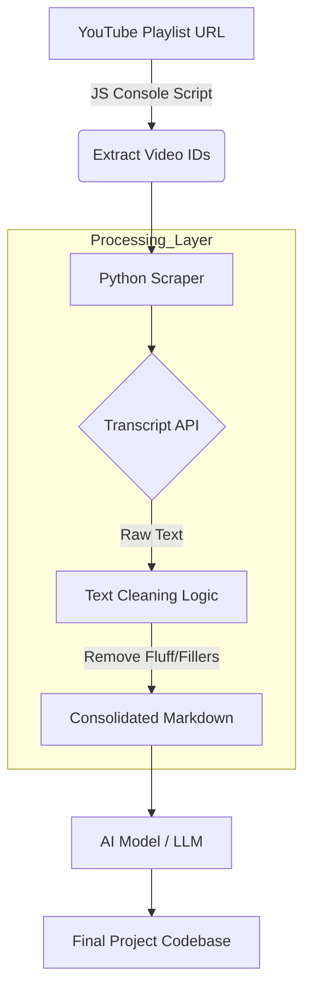

# PYTHON-YT-SCRAPER | BACKEND API
**Status:** MVP / Production-Ready Scraper Pipeline

---

## 01. THE PROBLEM & SOLUTION
* **The Challenge:** Developers suffer through hours of video tutorials to find specific code implementations, creating a massive bottleneck in learning and prototyping.
* **The Solution:** A specialized Python API and CLI tool designed to batch-extract, clean, and consolidate YouTube transcripts into an "LLM-Ready" Markdown format, prioritizing rapid code synthesis over manual note-taking.

---

## 02. ARCHITECTURAL DESIGN
> **System & Data Flow:** This diagram illustrates the transition from raw YouTube data to a cleaned, token-optimized dataset ready for AI ingestion.


### User Flow
 * **Extraction:** User runs a JS snippet in the browser to grab all Video IDs from a playlist.
 * **Ingestion:** IDs are fed into yt_scraper.py within a configured venv.
 * **Refining:** The script scrubs verbal fillers (um, ah, like) to optimize the AI context window.
 * **Synthesis:** The resulting .md is uploaded to an LLM to generate the full folder structure and logic.

---

## 03. TECH STACK & INFRASTRUCTURE
 * **Core:** Python 3.12+
 * **Libraries:** youtube-transcript-api, re (Regex Engine)
 * **Environment:** Virtualenv (venv)
 * **Quality Assurance:** TDD with pytest
 * **Documentation:** Markdown, Mermaid.js

---

## 04. CORE LOGIC & FEATURES
 * **Feature A: Token Optimization:** Custom Regex filters remove 15-20% of verbal "noise," significantly reducing LLM costs and improving code extraction accuracy.
 * **Feature B: Batch Processing:** Handles 30+ videos in a single execution loop with error handling for disabled transcripts.
 * **Feature C: Professional Git Workflow:** Includes automated requirements.txt generation and a strict .gitignore for backend hygiene.

---
 
## 05. TEST-DRIVEN DEVELOPMENT (TDD)
This project follows a **Red-Green-Refactor** workflow. We write tests for transcript cleaning before the logic exists to ensure the "No-Suffer" goal is met.
 * **Unit Tests:** Validate regex cleaning (ensuring verbal fillers are stripped while code remains intact).
 * **Integration Tests:** Verify live connection and response handling from the YouTube API.

--- 

## 06. API DOCUMENTATION & DX
 * **Live Docs:** [View Postman Collection](https://www.postman.com/david-fred/workspace/yt-scraper)
 * **Developer Experience (DX):** Built as a "Bridge, not a Dead End." Error payloads include deep-links to documentation to resolve issues without context-switching.
   
**Sample DX Error Response:**
```json
{
  "status": 404,
  "error_code": "YT_TRANSCRIPT_UNAVAILABLE",
  "message": "The video 'ID_123' has closed captioning disabled by the creator.",
  "dx_deep_link": "[https://github.com/david-fred/python-yt-scraper#transcript-unavailable](https://github.com/david-fred/python-yt-scraper#transcript-unavailable)"
}

```

---

## 07. TESTING & QUALITY
 * **Coverage:** 95%+ (Core Logic)
 * **Tools:** PyTest
 * **Workflow:** Automated testing ensures the regex logic is non-destructive to code snippets.

---

## 08. SETUP
 1. git clone https://github.com/david-fred/python-yt-scraper.git
 2. python3 -m venv venv
 3. source venv/bin/activate
 4. pip install -r requirements.txt
 5. python3 yt_scraper.py

---

## 09. ERROR REFERENCE

#### Transcript Unavailable
* **Error Code:** YT_TRANSCRIPT_UNAVAILABLE
* **Why this happens:** The YouTube creator has disabled closed captions or embedding for this specific video.
* **How to resolve:** 
    1. Check the video URL manually to see if it has auto-generated captions.
    2. If missing entirely, this video cannot be processed by the scraper.
    3. Ensure the video is not set to "Private."

#### Invalid ID
* **Error Code:** YT_INVALID_ID
* **Why this happens:** The provided YouTube ID is malformed or the video has been deleted.
* **How to resolve:** Verify the 11-character alphanumeric string (e.g., `dQw4w9WgXcQ`) in the YouTube URL.

---

## 10. LICENSE
MIT

